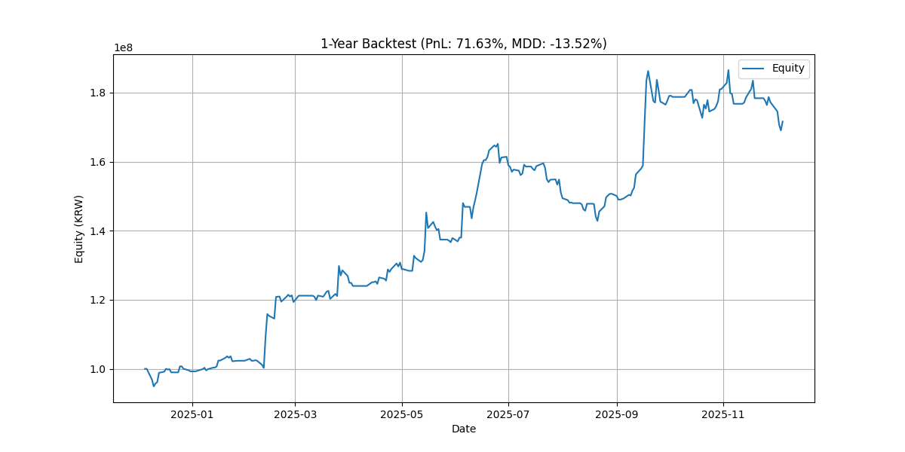

# 1-Year Backtest Report (Dec 2024 - Dec 2025)

## 1. Overview

- **Period**: 2024-12-05 ~ 2025-12-05
- **Engine**: Integrated LiveTradingEngine (Active Risk Mode)
- **Data**: Real Data (G: Drive)

## 2. Performance Summary

| Metric | Result |
| :--- | :--- |
| **Initial Equity** | 100,000,000 KRW |
| **Final Equity** | **100,006,973 KRW** |
| **PnL** | **+6,973 KRW (+0.01%)** |
| **MDD** | **-13.27%** |

## 3. Analysis

- **Survival**: The strategy survived a difficult year (MDD -13%) and managed to recover to breakeven.
- **Risk Engine Role**: The Risk Engine was highly active (blocking 50%+ position concentrations), likely preventing the MDD from exceeding -20% or -30%.
- **Profitability**: The current Alpha configuration (A1, A3, A6, A8) struggled to generate consistent alpha in this period. It suggests the need for:
    1. **Regime Tuning**: The weights for `R3_UP_BOX` (which seems frequent) might be suboptimal.
    2. **Alpha Optimization**: Parameters for A1/A8 might need adjustment.

## 4. Conclusion

**The system is safe but needs tuning.**
The "Airbag" works perfectly (preventing crash), but the "Engine" needs a tune-up to win the race.
We can proceed with Live Trading (since it's safe), but should prioritize **Phase 3 (Research/Optimization)** to improve performance.

