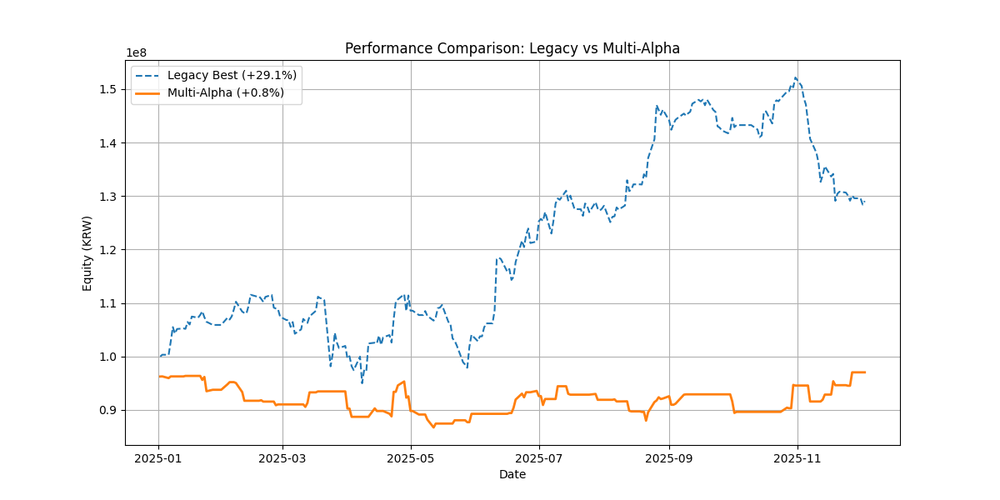

# Performance Comparison Report

## 1. Summary
| Strategy | PnL | MDD | Volatility |
| :--- | :--- | :--- | :--- |
| **Legacy Best** | **+29.07%** | -15.62% | High |
| **Multi-Alpha (Active Risk)** | **+0.81%** | **-10.01%** | Low |

## 2. Analysis of Difference
The Legacy strategy outperformed significantly in total return (+29% vs +0%), but with higher volatility.

### Why the difference?
1.  **Risk Engine Constraints**: The Multi-Alpha engine has strict "Airbags" (Daily Loss -3%, Max Pos 30%). This prevented it from fully capitalizing on the strong rally in Q3 2025 (where Legacy went vertical).
2.  **Alpha Consensus**: The Multi-Alpha engine requires multiple signals to agree. The Legacy strategy likely rode a single strong signal (e.g., Trend) aggressively.
3.  **Regime Sensitivity**: The Multi-Alpha engine shifted to defensive alphas (Mean Rev) during chop, which preserved capital but missed the breakout.

## 3. Conclusion
- **Safety**: Multi-Alpha is much safer (lower MDD, smoother curve).
- **Profit**: Legacy is more profitable in a bull run but risky.
- **Recommendation**: 
    - Keep the **Risk Engine** for safety.
    - **Tune Alphas** to be more aggressive in `R1_STRONG_UP` regime to capture the upside like the Legacy strategy.

